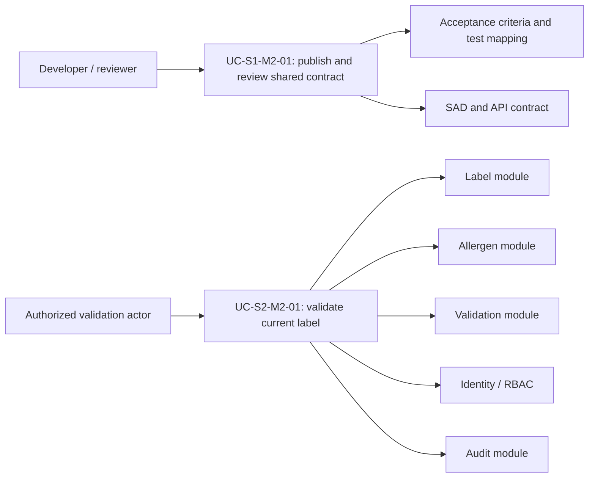
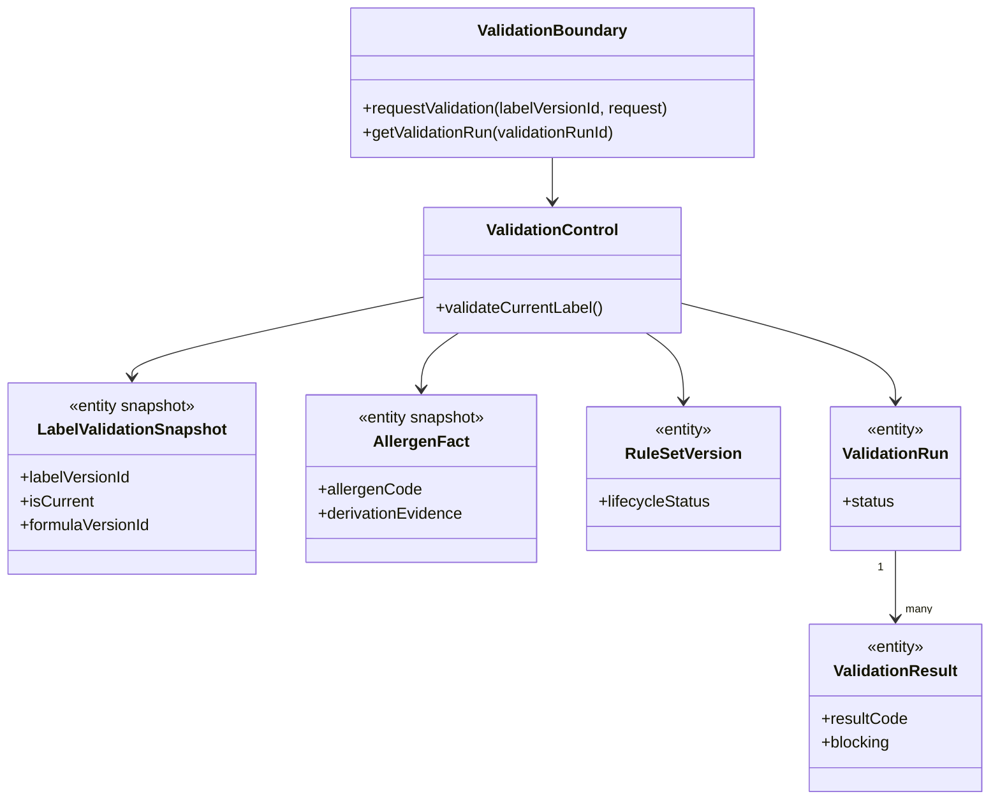
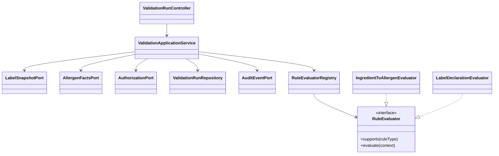

# S1-M2 analysis-to-design trace

Status: **design baseline merged in PR #3 and reconciled with the M1/M4/M5 runtime at
`a3bb498bb565e4f53d8161ba837f833d6bb9167b`; closure review remains a real PR gate**.

This trace follows the course chain: use-case flow → analysis objects/sequences →
transition strategy → design objects/sequences. It supports the M2 S1 SAD/contract
work order and prepares, but does not claim implementation of, M2's later validation
slice.

## Scope and use cases

`UC-S1-M2-01` is the in-scope Sprint 1 governance use case. `UC-S2-M2-01` is shown as
a relevant future consumer so that the shared contract is not designed in isolation.



### UC-S1-M2-01 — publish and review the shared contract

Normal flow:

1. M2 maps the contract to the approved modules, business rules, and canonical schema.
2. M2 publishes the SAD, API contract, acceptance criteria, and test mapping on an
   isolated branch.
3. M1/M4/M5 review the affected boundary, error, fixture, and evidence assumptions.
4. Review feedback is resolved before integration.

Exceptional flow: if a proposal needs a schema change, an unowned repository shortcut,
or a contract-breaking change, stop it and request PM change control or owner review.

### UC-S2-M2-01 — validate the exact current label (prepared consumer)

Normal flow: an authorized actor requests validation of the current label version; the
validation module obtains an immutable label snapshot, evaluates active rules through
strategies, stores an attributable run/results, records audit evidence, and returns the
run representation.

Exceptional flows: absent label/run returns `RESOURCE_NOT_FOUND`; a non-current label
returns `LABEL_VERSION_NOT_CURRENT`; insufficient canonical inputs return
`VALIDATION_PRECONDITION_FAILED`; lack of permission returns `AUTHORIZATION_DENIED`.

## Analysis model



```mermaid
sequenceDiagram
  actor Actor
  participant B as ValidationBoundary
  participant C as ValidationControl
  participant L as Label snapshot port
  participant A as Allergen facts port
  participant I as Identity port
  participant AU as Audit port
  Actor->>B: POST validation run
  B->>I: authorize(actor, VALIDATE_LABEL)
  alt unauthorized
    I-->>B: denied
    B-->>Actor: 403 AUTHORIZATION_DENIED
  else authorized
    B->>C: validateCurrentLabel(labelVersionId)
    C->>L: loadCurrentSnapshot(labelVersionId)
    alt missing or non-current
      L-->>B: absent / non-current
      B-->>Actor: 404 or 409 ApiError
    else current
      C->>A: deriveAllergenFacts(snapshot)
      C->>AU: record validation audit in transaction
      C-->>B: ValidationRun
      B-->>Actor: 201 ValidationRun
    end
  end
```

## Transition strategies applied

| Strategy | Analysis types/use cases affected | Static transition | Dynamic transition |
| --- | --- | --- | --- |
| Boundary → application service | HTTP request/response and `UC-S2-M2-01` | `ValidationBoundary` becomes controller + DTO mapper; `ValidationControl` becomes an application service | HTTP concerns end at the controller; the service coordinates ports and transaction policy |
| Entity → immutable cross-module snapshot | label/allergen facts used by validation | modules expose immutable DTO/port contracts rather than entities/repositories | validation receives a stable snapshot and cannot mutate a foreign aggregate |
| Conditional policy → Strategy registry | rule evaluation for each `rule_type` | `RuleEvaluator` implementations replace a central branching evaluator | orchestration invokes every applicable evaluator and collects all findings |
| Business outcome → API error envelope | all exceptional flows | domain failures map to stable `ApiError.code` values | caller receives deterministic 4xx semantics rather than parsing messages |

## Design model



The design deliberately leaves concrete package names and persistence adapters to the
post-merge implementation branch. They must conform to existing module boundaries and
the selected contract; this document does not authorize direct cross-module SQL.
