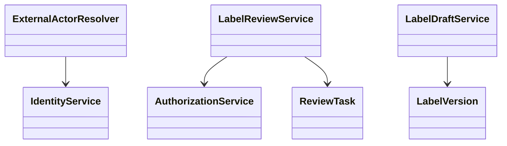
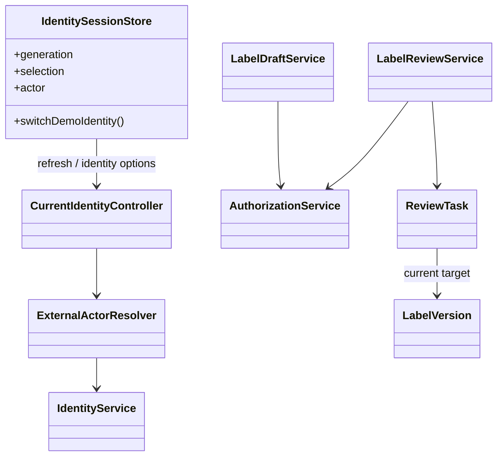

# SCRUM-84 A07 — identity and label workflow integration

**Status:** Draft. Diagrams below distinguish current classes from the target integration contract. The diagrams are not evidence of deployment.

## Before — current baseline model



## After — integration model (partially implemented)



## Normal publication path

```mermaid
sequenceDiagram
  actor Maker
  actor Checker
  actor Publisher
  participant UI
  participant API
  participant DB
  Maker->>UI: Select Maker, create V1
  UI->>API: Create draft + run validation(V1)
  API->>DB: Store V1 + validation run
  Maker->>UI: Submit V1
  UI->>API: Submit for review
  Checker->>UI: Switch identity and reload task
  UI->>API: APPROVE V1
  API->>DB: Matching approval_record(V1)
  Publisher->>UI: Switch identity and reload task
  UI->>API: Publish V1
  API->>DB: Check validation, current version and APPROVE; commit atomically
```

## REQUEST_CHANGES revision path

```mermaid
sequenceDiagram
  actor Maker
  actor Checker
  actor Publisher
  participant UI
  participant API
  participant DB
  Checker->>API: REQUEST_CHANGES(V1)
  API->>DB: Keep ReviewTask ID and historical decision
  Maker->>UI: Switch to Maker; load returned task
  Maker->>UI: Edit declaration snapshot
  UI->>API: Create returned revision V2
  API->>DB: Atomically create V2 and rebind same task
  API-->>UI: V2 with no inherited PASSED validation
  Maker->>API: Validate V2; submit V2
  Checker->>API: APPROVE V2 (independent user)
  Publisher->>API: Publish V2
  API->>DB: Verify exact V2 validation and APPROVE record
```

## State and transition policy

| Operation | Preconditions | Required outcome |
| --- | --- | --- |
| Create draft | Maker with `LABEL.CREATE` | New DRAFT version; old versions unchanged |
| Submit | Current task target, exact-version PASSED validation, `LABEL.SUBMIT_REVIEW` | PENDING_REVIEW / task IN_REVIEW |
| REQUEST_CHANGES | Independent Checker, task in review | Task returned OPEN with recorded decision; historical V1 retained |
| Revise | Returned task OPEN / REQUEST_CHANGES; authorized Maker | Same task ID, new DRAFT V2, target rebound; no inherited validation |
| APPROVE | Independent Checker; current target with PASSED validation | APPROVED and matching approval record for target |
| Publish | Authorized Publisher; current formula/version, matching approval and validation | One atomic publication and consistent pointer/audit |

All rejected or stale operations must have no committed partial publication writes. Exact state names must be reconciled against the backend service and migration before final sign-off.
