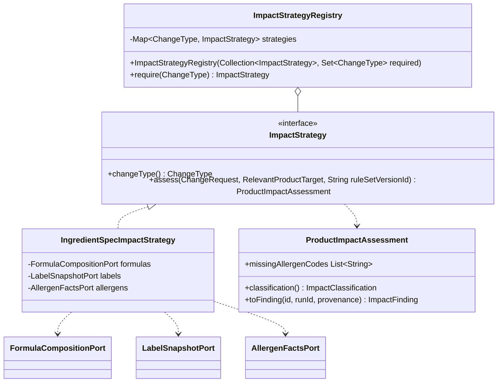
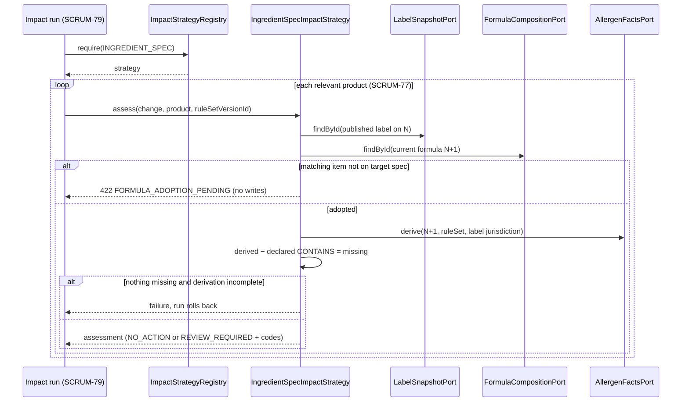

# A07 draft — M1 Impact Strategy design problem

Owner: Huang Xiangjia / M1. Related: SCRUM-47, SCRUM-78 (built on SCRUM-77).
Date: 2026-10-04, finalised 2026-10-06 (SCRUM-80). Status: **final**. The class names below
are the real ones in `com.spectrace.impact.application.strategy`, and the orchestration that
uses them is SCRUM-79's `ChangeImpactAnalysisService`. The use-case diagrams are in
[A07 Run Change Impact Analysis](S3-M1-A07-run-change-impact-analysis.md).

## Problem statement

A `ChangeRequest` has a `changeType`: `INGREDIENT_SPEC`, `FORMULA` or `RULE_SET`, the V2
CHECK tokens. Each type needs a different way to decide whether a relevant product's
published label is still correct:

- **`INGREDIENT_SPEC`** (Sprint 3): derive allergens from the adopted FormulaVersion N+1
  and compare them with the CONTAINS declarations of the label published on N.
- **`FORMULA` / `RULE_SET`** (later): different inputs. A formula diff, or a re-derivation
  under a new rule set.

The analysis flow itself is the same for every type. It discovers relevant products,
classifies each one NO_ACTION or REVIEW_REQUIRED, opens ReviewTasks and persists
atomically. Two forces pull against each other:

1. **Open for new change types.** Adding `FORMULA` later should not mean editing a
   classification method that already passes for `INGREDIENT_SPEC`.
2. **Fail closed.** This is a safety classification. A misconfigured or missing
   classifier must never quietly return NO_ACTION. The same goes for an incomplete
   derivation (no components, or UNMAPPED/AMBIGUOUS ones).

## Candidate patterns

| Option | Benefit | Cost / failure mode | Decision |
| --- | --- | --- | --- |
| `switch (changeType)` inside the analysis service | Smallest first version | Every new type edits the orchestrator. A `default` branch becomes a silent fallback. Classification and transaction code can't be tested separately. | Reject |
| Class hierarchy: an abstract `ImpactAnalysis` with a subclass per type (Template Method) | Shares the flow skeleton | The persistence/transaction flow gets tied to inheritance, and each subclass inherits the whole run. Sprint 2 already chose composition for rule evaluation. | Reject |
| Chain of Responsibility: each handler checks whether it "supports" the type | Easy to add handlers | If nothing handles the type, the result is null or default unless it is checked separately. The order of handlers changes behaviour. | Reject |
| **Strategy, chosen through an immutable registry keyed by `ChangeType`** | One class per type. The orchestrator depends only on the interface. A duplicate or missing required strategy is caught at startup. Same idiom as Sprint 2's `RuleEvaluatorRegistry`. | One more small type (the registry). Unimplemented types must be enforced explicitly. | **Chosen** |
| External rules engine (e.g. Drools) | Rules can be configured | Heavy dependency and opaque evidence. Allergen derivation is already relational and versioned. | Reject |

## Rationale

- **Consistent with Sprint 2 (SAD-003).** Validation already chooses `RuleEvaluator`s
  through `RuleEvaluatorRegistry`, which uses an `EnumMap`, rejects duplicates and fails
  explicitly on a missing type. Using the same shape for impact keeps one mental model for
  "dispatch by version-controlled type".
- **Startup failure, not runtime fallback.** `ImpactStrategyRegistry` takes the strategies
  plus the set of *required* types. Spring builds it with `EnumSet.of(INGREDIENT_SPEC)`. If
  that strategy is missing, or registered twice, the application context does not start.
- **Extension points, not placeholder beans.** `FORMULA` and `RULE_SET` have no strategy and
  no stub bean. Asking for one throws `IllegalStateException`, so no fake classification is
  produced.
- **The strategy owns the domain decision only.** It reads through catalog, label and
  allergen ports and writes nothing. It returns a `ProductImpactAssessment`, and the run
  (SCRUM-79) later gives that assessment its ID, run and provenance. The classification is
  computed from `missingAllergenCodes`, so the two can never disagree.
- **Fail-closed derivation.** An empty derivation counts as "no allergens" only when it is
  complete: every N+1 item has components, and every component is `MATCHED`. An incomplete
  derivation can still prove that an allergen is missing (REVIEW_REQUIRED, with a note). It
  can never prove that nothing is missing. In that case the run fails and rolls back.

## Before / after

**Before:** one service decides everything for every type.

```java
// Hypothetical "switch in the service" version that we rejected
ImpactFinding classify(ChangeRequest change, Product product) {
    switch (change.changeType()) {
        case INGREDIENT_SPEC: /* derive, compare, build finding */ break;
        case FORMULA:         /* TODO */ break;
        default:              return noAction(product); // silent fallback
    }
}
```

**After:** the orchestrator asks the registry and depends only on the interface.

```java
// ChangeImpactAnalysisService.run (SCRUM-79)
ImpactStrategy strategy = strategies.require(change.changeType());   // fails if unregistered
List<ProductImpactAssessment> assessments = discovery.discover(materialId).stream()
        .map(product -> strategy.assess(change, product, ruleSetVersionId))
        .toList();                                                    // every 422 before a write
...
List<ImpactFinding> newFindings = assessments.stream()
        .map(assessment -> assessment.toFinding(ids.get(), runId, provenance))
        .toList();
```





## Verification

- `ImpactStrategyRegistryTest` (6): resolution, a duplicate registration (even the same
  instance), a missing required type at construction, unregistered extension points,
  immutability, nulls.
- `IngredientSpecImpactStrategyTest` (14): NO_ACTION and REVIEW_REQUIRED, sorted missing
  codes, only CONTAINS counts, matching by allergen ID, complete-empty vs incomplete-empty
  derivations, adoption pending (with and without N+1), label already on N+1 (409), and
  inconsistent reads.
- `IngredientSpecImpactStrategyMySqlTest` (3, real adapters on the V3 seed): with a Spec V2
  fixture that adds Soy Lecithin and an N+1 adoption fixture, the classification equals
  M2's golden `S3-M2-SOY-SPEC-V2-IMPACT` v1 exactly. That is 20 NO_ACTION, 20
  REVIEW_REQUIRED with `[SOY]`, and the 20 negative controls absent. Before adoption, every
  product is `FORMULA_ADOPTION_PENDING`.

## Outcome (SCRUM-79/80)

- **The orchestrator never names a change type.** `ChangeImpactAnalysisService` asks the
  registry and calls `assess`. Adding `FORMULA` means one new `ImpactStrategy` bean and
  adding the type to the required set in `ImpactInfrastructureConfiguration`; the service
  does not change.
- **Fail-closed holds end to end.** A strategy failure (`FORMULA_ADOPTION_PENDING`, or an
  incomplete derivation) happens before `ImpactAnalysisApplicationService.execute`, so the
  API test shows no run, finding, task or audit row and an unchanged SUBMITTED status.
- **The verdicts are correct on real data.** `SoyGoldenImpactRunMySqlTest` drives the SOY
  scenario over HTTP, and every one of the 60 products matches M2's golden. The 20
  REVIEW_REQUIRED products each have exactly one OPEN task, and the 20 negative controls
  have no finding.

## Remaining items

- Replace the Spec V2 / N+1 test fixture (`fixtures/s3-soy-spec-v2-adoption.sql`) with M2's
  real adoption (SCRUM-55/56) once it merges.
- Contract decision pending with M2: whether an incomplete derivation gets its own 422
  code. Today it is a 500 rollback under the frozen v1 error matrix.
