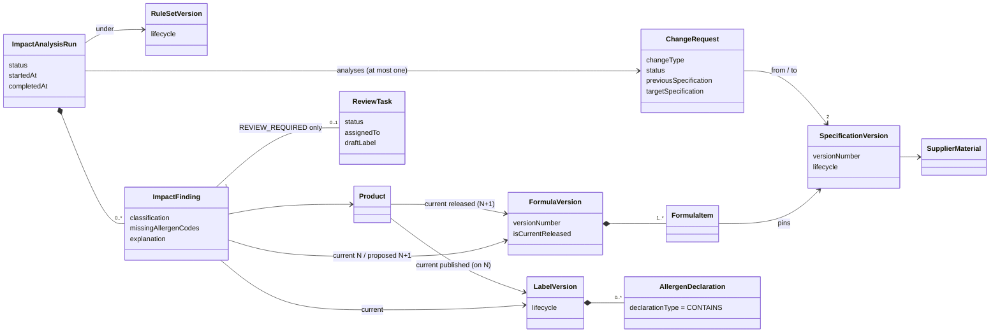
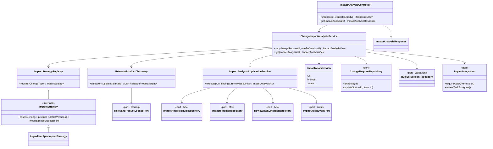
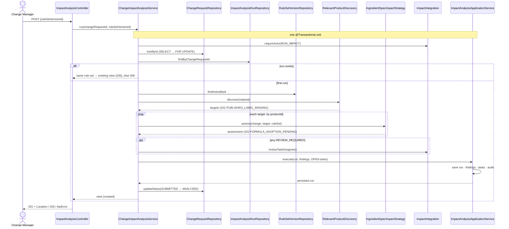

# A07 — M1 use case: Run Change Impact Analysis

Owner: Huang Xiangjia / M1. Related: SCRUM-47, SCRUM-77–80.
Date: 2026-10-06. Status: **final for SCRUM-80**. The design diagrams use real class and
method names on the SCRUM-79/80 branches; the analysis diagram uses domain terms only.
The design problem for this use case is the
[Impact Strategy](S3-M1-A07-impact-strategy-draft.md).

## Use case

**Actor:** Change Manager (`IMPACT.RUN`).
**Goal:** for a recorded INGREDIENT_SPEC change request, find every product whose current
formula uses the changed supplier material, decide whether its published label is still
complete (NO_ACTION) or needs review (REVIEW_REQUIRED), and open a ReviewTask for each
product that needs one.

**Preconditions:**
- The change request is SUBMITTED.
- The rule set is ACTIVE.
- Every relevant product has a current published label.
- Every relevant product has adopted the target specification in a formula version N+1.

**Postconditions, all or nothing:**
- One COMPLETED run.
- One finding per relevant product.
- One OPEN ReviewTask per REVIEW_REQUIRED finding, with no draft label yet.
- One audit event.
- The change request is ANALYZED.
- Replaying the same request with the same rule set returns the same run.

**Alternate flows:**
- 422 `RULE_SET_NOT_ACTIVE`, `PUBLISHED_LABEL_MISSING` or `FORMULA_ADOPTION_PENDING`, with
  nothing written.
- 409 for a different rule set on a request that already has a run, or for a CANCELLED
  request.
- 500 with a full rollback on any server or audit failure.

## Analysis class diagram

## Design class diagram

The impact application layer depends only on ports. The catalog, label, allergen, validation,
identity and audit modules own their adapters, and no impact code reads their tables. M5 owns
the run/finding/task persistence and its idempotency.

## Design sequence diagram: `POST /api/v1/change-requests/{id}/impact-analyses`

Every 422 is raised before `execute`, so a failed precondition writes nothing. Two concurrent
triggers of one request are handled twice over:

- The second waits on the change-request row lock.
- If its snapshot still misses the winner's run, M5's insert hits the
  `impact-analysis:<changeRequestId>` idempotency key, `execute` returns the winner's run,
  and the service answers 200.

## Verification links

- [SCRUM-80 evidence](S3-M1-SCRUM-80-soy-golden-e2e.md): golden end-to-end results.
- [SCRUM-79 notes](../s3-m1/SCRUM-79-impact-run.md): API, rollback and concurrency tests.
- [SCRUM-77](../s3-m1/SCRUM-77-relevant-product-discovery.md) and
  [SCRUM-78](../s3-m1/SCRUM-78-impact-strategy.md): discovery and classification rules.
