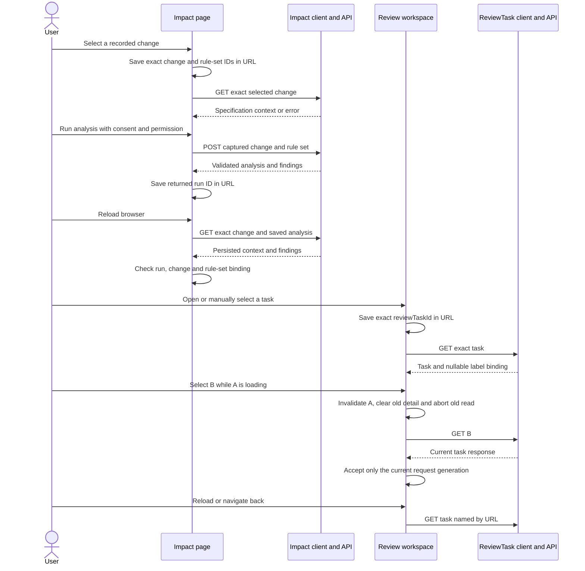
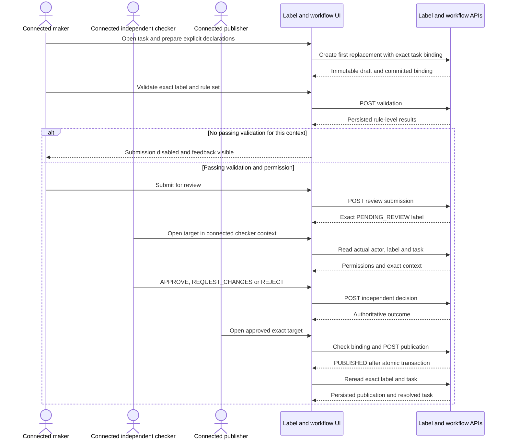

# A07 — M3 impact, review and publication UI

Owner: Xu Feiyang / M3. Updated: 8 October 2026. Tasks: SCRUM-49/71–74.
Status: implementation-bound delivery; final acceptance and owner decisions pending.
Latest baseline: main `73600b8`, integrated safely into XFY. It preserves the
production sources of `0dc1737` on which the local state repairs were qualified.

## Scope and actual implementation

The user follows specification change → impact findings → exact ReviewTask →
replacement label → rule-level validation → independent decision → publication.
M3 consumes owner APIs. Classification, authentication/authorization, validation
policy, maker-checker and atomic publication remain backend responsibilities.

Actual contracts: [impact](../contracts/s3-impact-review-publication-api-v1.yaml),
[product flow](../contracts/s3-label-product-flow-api-v1.yaml), and its
[error matrix](../contracts/s3-label-product-flow-error-matrix-v1.md).
The broader [integration A07](../architecture/S3-label-product-flow-a07.md)
records backend classes and transactions. This document records M3's UI design.

| Concern | Actual source | Behavior |
| --- | --- | --- |
| Change/run context | [Impact.tsx](../../frontend/src/pages/Impact.tsx), [impact client](../../frontend/src/api/impact.ts) | Complete paged reads, deduplication, exact change/run/rule-set URL context and GET-only restoration |
| Task context | [Reviews.tsx](../../frontend/src/pages/Reviews.tsx), [workflow client](../../frontend/src/api/label-workflow.ts) | Bounded filtered pages; manual selection, reload and browser back preserve the exact task |
| First replacement | [Labels.tsx](../../frontend/src/pages/Labels.tsx) | Exact task/product/formula binding; first-create immutable declarations; catalog readiness guard |
| Validation | [LabelValidationPanel.tsx](../../frontend/src/components/LabelValidationPanel.tsx) | Rule-level results bound to the exact label/rule set; declarations and derived facts remain separate |
| Workflow | [LabelWorkflowPanel.tsx](../../frontend/src/components/LabelWorkflowPanel.tsx) | Separate commands, exact responses, permission controls and uncertain-command reconciliation |
| Identity | [CurrentIdentityPanel.tsx](../../frontend/src/components/CurrentIdentityPanel.tsx) | Actual connected user/permissions; fail closed while unavailable; refresh does not select another actor |

## Implemented sequence: preserve resource context

A fresh returned POST/read response supplies its own URL transition without an
unnecessary second analysis GET. Reload/back/refresh reread authoritative state.
No restored URL causes a business POST. Wrong IDs or run/change/rule-set pairs
produce errors, never a switch to first/current/latest. An uncertain analysis
is reconciled only against its captured change/rule-set context.
Manual reads capture both URL and context generation and are aborted/ignored
after navigation. Completed create/run commands for an earlier selection report
their actual returned resource ID without redirecting the newer view; cancelling
a UI read is never presented as undoing a committed write.

## Implemented sequence: validate, independently review and publish

These actor contexts are distinct supported callers; the sequence does not
claim an implemented in-product switch. M4 must adopt the login/demo decision
and controlled switch. Approval is separate from publication. Live tests verify
old SUPERSEDED/new PUBLISHED labels, CLOSED tasks and immutable history.

## Individual design problem: async consistency across context changes

The old task page displayed B after a manual click but reloaded A or no task
from an unchanged URL. In-memory impact results also disappeared on reload.
Late responses could replace the next selection, while an unconfirmed command
could be mistaken for a safe retry.

| Option | Tradeoff | Decision |
| --- | --- | --- |
| Component state only | Simple, but refresh/back cannot recover exact context | Replaced for resource selection |
| Store whole responses in browser storage | Can silently show stale workflow/permissions | Rejected as resource authority |
| URL IDs plus authoritative reads and async guards | Reuses router/React; requires mismatch and cancellation handling | Implemented |
| New workflow/query framework | Duplicates existing mechanisms and unsettled policies | Not needed |

Presentation states (loading, ready, error, command in flight, unconfirmed)
remain separate from server lifecycle enums. Abort plus active/generation guards
prevent obsolete reads from committing. Task-detail and change-list reads have
15-second deadlines and visible read retries. Empty collections, failed/capped
traversals and ready results are distinct; partial choices are not published as
complete. Guards remain component-local, not durable cross-page command tracking.

## Verification and remaining acceptance

[Current test/evidence record](S3-M3-test-design.md) separates predecessor main
CI, current fixture regressions and current Docker executions. The new
`s3-state-regressions.spec.ts` covers URL/reload/back, no command replay, mismatch,
paging, late success/error, timeout/retry and permitted-creator UI behavior.

The real seeded officer's approval attempt is ACL403 because that maker lacks
APPROVE. A UI-only fixture supplies APPROVE to the same creator and proves clear
independent-review feedback and disabled approval, without changing stored
grants. Existing backend service/unit maker-checker proof remains separate.
A permitted-creator HTTP/database/browser negative is now supplied by merged
PR72 and its actual main workflow 37765740477, separately from the older officer
ACL and local UI fixtures. See [the source/evidence supplement](S3-compound-maker-negative-20261008.md).
Its disposable identity does not adopt M4's login/demo-switch choice.

M3 assesses this A07 and accepts its exact consumer contract scope. M4 owns
login/demo switching; M5 owns staging. Tests and artifacts do not adopt those
choices. REQUEST_CHANGES returns the same immutable draft; declaration editing
or task rebinding is not invented as a correction flow.
