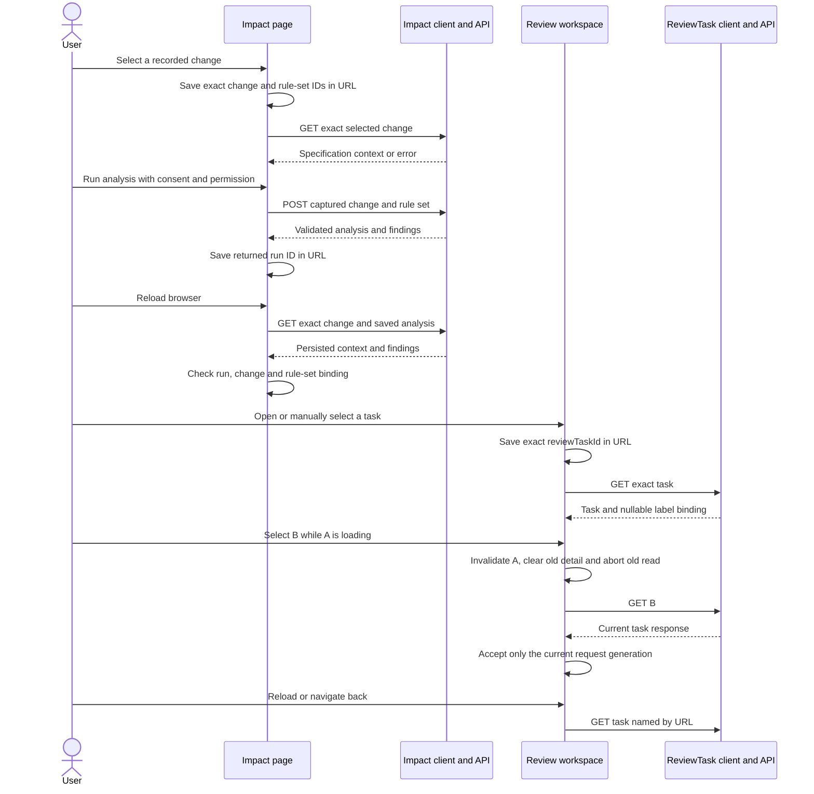

# A07 — M3 impact, review and publication UI

Owner: Xu Feiyang / M3. Updated: 9 October 2026. Tasks: SCRUM-49/71–74.
Status: verified local integration; final team acceptance and merged-main CI pending.
Baseline: main `36f52bf` plus owner integration PR87 `417133e`, integrated locally
into XFY while retaining the PR76 context repairs. The earlier Docker receipts
remain historical; the new returned-revision path has its own execution record.

## Scope and actual implementation

The user follows specification change → impact findings → exact ReviewTask →
replacement label → rule-level validation → independent decision → publication.
M3 consumes owner APIs. Classification, authentication/authorization, validation
policy, maker-checker and atomic publication remain backend responsibilities.

Actual contracts: [impact](../contracts/s3-impact-review-publication-api-v1.yaml),
[product flow](../contracts/s3-label-product-flow-api-v1.yaml), and its
[error matrix](../contracts/s3-label-product-flow-error-matrix-v1.md).
The broader [integration A07](../architecture/S3-label-product-flow-a07.md)
records backend classes and transactions. This document records M3's UI design.

| Concern | Actual source | Behavior |
| --- | --- | --- |
| Change/run context | [Impact.tsx](../../frontend/src/pages/Impact.tsx), [impact client](../../frontend/src/api/impact.ts) | Complete paged reads, deduplication, exact change/run/rule-set URL context and GET-only restoration |
| Task context | [Reviews.tsx](../../frontend/src/pages/Reviews.tsx), [workflow client](../../frontend/src/api/label-workflow.ts) | Bounded filtered pages; manual selection, reload and browser back preserve the exact task |
| First replacement | [Labels.tsx](../../frontend/src/pages/Labels.tsx) | Exact task/product/formula binding; first-create immutable declarations; catalog readiness guard |
| Returned replacement | [Labels.tsx](../../frontend/src/pages/Labels.tsx), [declaration panel](../../frontend/src/components/LabelDeclarationsPanel.tsx) | Save a complete new declaration snapshot as a new immutable ID; retain the same task; clear old PASS and verify the new binding |
| Validation | [LabelValidationPanel.tsx](../../frontend/src/components/LabelValidationPanel.tsx) | Rule-level results bound to the exact label/rule set; declarations and derived facts remain separate |
| Workflow | [LabelWorkflowPanel.tsx](../../frontend/src/components/LabelWorkflowPanel.tsx) | Separate commands, exact responses, permission controls and uncertain-command reconciliation |
| Identity | [CurrentIdentityPanel.tsx](../../frontend/src/components/CurrentIdentityPanel.tsx), [identity session](../../frontend/src/api/identity-session.ts) | Controlled demo Maker/Checker/Publisher; verify server permissions; invalidate old responses and consent; reload verifies the stored selection |

## Implemented sequence: preserve resource context



A fresh returned POST/read response supplies its own URL transition without an
unnecessary second analysis GET. Reload/back/refresh reread authoritative state.
No restored URL causes a business POST. Wrong IDs or run/change/rule-set pairs
produce errors, never a switch to first/current/latest. An uncertain analysis
is reconciled only against its captured change/rule-set context.
Manual reads capture both URL and context generation and are aborted/ignored
after navigation. Completed create/run commands for an earlier selection report
their actual returned resource ID without redirecting the newer view; cancelling
a UI read is never presented as undoing a committed write.

## Implemented sequence: validate, independently review and publish

```mermaid
sequenceDiagram
    actor maker as Connected maker
    actor checker as Connected independent checker
    actor publisher as Connected publisher
    participant ui as Label and workflow UI
    participant api as Label and workflow APIs
    maker->>ui: Open task and prepare explicit declarations
    ui->>api: Create first replacement with exact task binding
    api-->>ui: Immutable draft and committed binding
    maker->>ui: Validate exact label and rule set
    ui->>api: POST validation
    api-->>ui: Persisted rule-level results
    alt No passing validation for this context
        ui-->>maker: Submission disabled and feedback visible
    else Passing validation and permission
        maker->>ui: Submit for review
        ui->>api: POST review submission
        api-->>ui: Exact PENDING_REVIEW label
        checker->>ui: Open target in connected checker context
        ui->>api: Read actual actor, label and task
        api-->>ui: Permissions and exact context
        checker->>ui: APPROVE, REQUEST_CHANGES or REJECT
        ui->>api: POST independent decision
        api-->>ui: Authoritative outcome
        alt REQUEST_CHANGES
            api-->>ui: Same task OPEN; old immutable label DRAFT
            maker->>ui: Switch to verified Maker; save complete revised declarations
            ui->>api: POST task draft-revisions with expected old label ID
            api-->>ui: New immutable label ID and committed task binding
            ui->>api: GET exact task and new declarations
            ui->>ui: Adopt new ID; clear old validation and consent
            maker->>ui: Validate new ID with its own returned rule set
            ui->>api: POST validation; then explicitly submit with current PASS
            api-->>ui: New version PENDING_REVIEW
            checker->>ui: Switch to verified independent Checker; APPROVE
            ui->>api: POST new-version decision
            api-->>ui: New version APPROVED
        else REJECT
            api-->>ui: Rejected state; publication unavailable
        end
        alt Exact target is APPROVED
            publisher->>ui: Open approved exact target
            ui->>api: Check binding and POST publication
            api-->>ui: PUBLISHED after atomic transaction
            ui->>api: Reread exact label and task
            api-->>ui: Persisted publication and resolved task
        else Target is not APPROVED
            ui-->>publisher: Publication remains unavailable
        end
    end
```

These are distinct server-side callers selected through M4's controlled local
demo switch. The backend verifies each operation and rejects DEV_EXTERNAL in
production; OIDC remains deferred. The stored selection is a demo preference,
not a token or proof of permissions. Reload resolves it through the server;
invalid/revoked permissions keep writes unavailable. Approval and publication
are separate. Only an APPROVED exact target proceeds to publication; REJECT
ends that path. The returned old replacement remains DRAFT with immutable
content and history. The original published label becomes SUPERSEDED only
after the new version is actually published.

## Individual design problem: async consistency across context changes

The old task page displayed B after a manual click but reloaded A or no task
from an unchanged URL. In-memory impact results also disappeared on reload.
Late responses could replace the next selection, while an unconfirmed command
could be mistaken for a safe retry.

| Option | Tradeoff | Decision |
| --- | --- | --- |
| Component state only | Simple, but refresh/back cannot recover exact context | Replaced for resource selection |
| Store whole responses in browser storage | Can silently show stale workflow/permissions | Rejected as resource authority |
| URL IDs plus authoritative reads and async guards | Reuses router/React; requires mismatch and cancellation handling | Implemented |
| New workflow/query framework | Duplicates existing mechanisms and unsettled policies | Not needed |

Presentation states (loading, ready, error, command in flight, unconfirmed)
remain separate from server lifecycle enums. Abort plus active/generation guards
prevent obsolete reads from committing. Task-detail and change-list reads have
15-second deadlines and visible read retries. Empty collections, failed/capped
traversals and ready results are distinct; partial choices are not published as
complete. Guards remain component-local, not durable cross-page command tracking.

Identity generation adds a boundary to URL/request generation. Switch/refresh
removes old permissions, consent and displayed responses; saved resource IDs
remain available for authenticated rereads. Review details retain their URL and
15-second deadline alongside that guard. Impact rereads saved context and ignores
old-actor completions. Switching cannot undo a committed command; unknown impact
commands retain captured inputs rather than clearing the protective guard.

Revision recovery captures the original task, expected old label, maker and full
declarations. 409, lost/invalid responses and 5xx lead only to exact reads. A
matching stored new version may be adopted without claiming causal proof of the
original command. Nonmatching state retains inputs and blocks another revision
POST. No expected ID is automatically replaced and no revision POST is retried.
New-ID adoption clears old PASS; the server also rechecks persisted current
validation at submit, APPROVE and publish.

## Verification and remaining acceptance

[Current test/evidence record](S3-M3-test-design.md) separates predecessor main
CI, current fixture regressions and current Docker executions. The new
`s3-state-regressions.spec.ts` covers URL/reload/back, no command replay, mismatch,
paging, late success/error, timeout/retry and permitted-creator UI behavior.

The real seeded officer's approval attempt is ACL403 because that maker lacks
APPROVE. A UI-only fixture supplies APPROVE to the same creator and proves clear
independent-review feedback and disabled approval, without changing stored
grants. Existing backend service/unit maker-checker proof remains separate.
A permitted-creator HTTP/database/browser negative is now supplied by merged
PR72 and its actual main workflow 37765740477, separately from the older officer
ACL and local UI fixtures. See [the source/evidence supplement](S3-compound-maker-negative-20261008.md).
Its disposable identity does not adopt M4's login/demo-switch choice.

M3's source assessment, M4's owner decision and M5's staging record retain their
separate attribution. The owner implementation is integrated locally; its
proposed ADR and unmerged PR are not team signoff or merged-main qualification.

## PR76 review follow-up — 9 October

[M1's review](https://github.com/hxj04121-lab/FoodLabelFlow/pull/76#issuecomment-6072749690)
accepts the impact versions, classification, task links, replay and GET-only
restoration. The client now also rejects NO_ACTION with missing codes and
REVIEW_REQUIRED without missing codes. An unknown create retains the complete
original request and offers an explicit retry of those same inputs. Form changes
and new creates remain disabled. A duplicate 409 is visible and keeps the
unknown-command guard: an existing record does not prove this caller created it.
Reads and retries do not silently report creation success. This guard is still
component-local and resets on reload; no durable command-result log is claimed.

[M2's handoff](https://github.com/hxj04121-lab/FoodLabelFlow/pull/76#issuecomment-6059466596)
defines a correction as a new immutable label on the same task, followed by that
new ID's validation, independent approval and separate publication. The draft
uses its own server-selected rule set, which need not equal the impact run's
rule set. A new revision must clear the old displayed PASS. Later FAILED results
must be checked by the server at submit, APPROVE and publish; timestamp/UUID
ordering cannot establish the current validation.

At the start of 9 October, [PR86](https://github.com/hxj04121-lab/FoodLabelFlow/pull/86)
provides switching and revision UI/API, and draft
[PR87](https://github.com/hxj04121-lab/FoodLabelFlow/pull/87) integrates current-run
guards and captured revision recovery. Neither is merged into main or XFY.
Their login ADR still said proposed; their full revision-browser acceptance
document says NOT RUN, and the current containers workflow does not execute that
new full revision test. Successful PR checks are not final main acceptance.
These owner implementations were reused in the current local integration,
preserving PR76's task URL/restoration/timeouts. A fresh local MySQL/browser run
now proves correction, exact validation, independent approval, publication and
immutable history; it is wired into a separate disposable CI stack. An inherited
reload bug that reset Publisher to Maker was corrected. Local results do not
substitute for the combined source's future merged-main CI.
