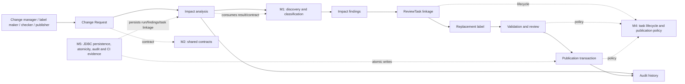
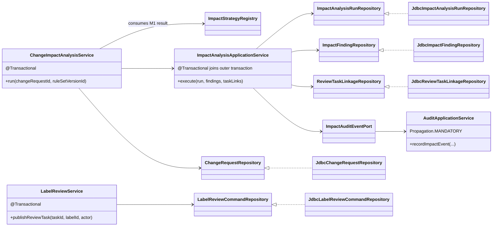

# A07 — SCRUM-70 impact persistence and publication units of work

Status: implemented-source design, based on main `73600b8578e29d8904e667be5eba06b1909d0be4`.

This artifact documents M5 persistence/audit ownership while consuming M1 impact
classification, M2 API contracts, and M4 ReviewTask and publication lifecycle
rules. It does not introduce another classification, contract, or lifecycle.

## 1. Use-case context



`NO_ACTION` findings have no ReviewTask. Each `REVIEW_REQUIRED` finding receives
one task linkage. The initial impact transaction ends before replacement-label
work and human review; publication is a later, separately guarded transaction.

## 2. Components and Unit of Work



Impact Unit of Work T1 includes the change-request status transition, run,
findings, ReviewTask rows/linkage, and `IMPACT_ANALYSIS_RUN` audit event. The
outer `ChangeImpactAnalysisService.run` transaction owns T1;
`ImpactAnalysisApplicationService.execute` joins it, and the audit port requires
it. The publication Unit of Work T2 is owned by
`LabelReviewService.publishReviewTask`; its repository atomically updates the
old/new label state, product pointer, task, publication record, and audit row.
User validation, submission, and approval are separate committed operations.

## 3. Sequence and failure paths

```mermaid
sequenceDiagram
    actor User
    participant API as Change / impact API
    participant Run as ChangeImpactAnalysisService
    participant M1 as M1 strategy/result
    participant Persist as ImpactAnalysisApplicationService
    participant RunDB as JdbcImpactAnalysisRunRepository
    participant ChangeDB as JdbcChangeRequestRepository
    participant FindingDB as JdbcImpactFindingRepository
    participant TaskDB as JdbcReviewTaskLinkageRepository
    participant Audit as AuditApplicationService
    participant Label as LabelReviewService
    participant PubDB as JdbcLabelReviewCommandRepository

    User->>API: Create Change Request, then trigger SOY analysis
    API->>Run: run(changeRequestId, ruleSetVersionId)
    Note over Run,Audit: T1 begins at @Transactional run()
    Run->>M1: discover and classify through owned strategy interface
    M1-->>Run: findings and outcomes (NO_ACTION / REVIEW_REQUIRED)
    Run->>Persist: execute(run, findings, task links)
    Persist->>RunDB: insert run (idempotency key = changeRequestId)
    Persist->>FindingDB: insert findings
    Persist->>TaskDB: link one task for each REVIEW_REQUIRED finding
    Persist->>Audit: recordImpactEvent (MANDATORY)
    Run->>ChangeDB: change request SUBMITTED -> ANALYZED
    Run-->>API: analysis with persisted IDs/provenance
    API-->>User: analysis and task handoffs
    Note over Run,Audit: T1 commits; replay returns the same logical analysis without writes

    User->>API: create replacement, validate, submit, independent approval
    User->>Label: publishReviewTask(taskId, exactLabelId, publisher)
    Note over Label,PubDB: T2 begins at @Transactional publishReviewTask()
    Label->>PubDB: lock task/product and check target/current/APPROVE guards
    PubDB->>PubDB: supersede old label; publish target; update pointer/task;
    PubDB->>PubDB: insert publication and audit records
    PubDB-->>Label: committed publication result
    Label-->>User: PUBLISHED exact label
    Note over Label,PubDB: T2 commits independently of T1 and earlier human actions

    alt Finding, ReviewTask, or impact audit write throws during T1
        Persist-->>Run: exception propagates
        Run-->>API: failure; transaction rollback
        Note over Run,TaskDB: no partial run/findings/tasks/audit/status transition
    else Publication guard or publication/audit write throws during T2
        PubDB-->>Label: exception propagates
        Label-->>User: failure; T2 rollback
        Note over Label,PubDB: no partial label pointer/task/publication/audit mutation
    end
```

## Transaction rationale and rejected alternative

The orchestration/application boundary can see the complete impact mutation and
use Spring's JDBC transaction to commit it as one unit. This preserves
atomicity and consistency: a failed finding, task, or audit write leaves no
partial run, and idempotent retry can safely return the committed run. Audit
provenance commits with the business mutation it describes. The M4 publication
command has its own boundary because it occurs after validation and human
decisions; its label, pointer, task, publication record, and audit remain atomic
without holding an impact transaction open across user work.

Rejected: `REQUIRES_NEW` for impact audit. An independently committed audit
could claim an impact run that the outer transaction later rolls back, leaving
inconsistent provenance. The port uses `Propagation.MANDATORY` and propagates
write failures instead.

## Source and evidence

- Impact orchestration: [ChangeImpactAnalysisService](../../backend/src/main/java/com/spectrace/impact/application/ChangeImpactAnalysisService.java)
- Impact Unit of Work: [ImpactAnalysisApplicationService](../../backend/src/main/java/com/spectrace/impact/application/ImpactAnalysisApplicationService.java)
- Audit propagation: [AuditApplicationService](../../backend/src/main/java/com/spectrace/audit/application/AuditApplicationService.java)
- Publication transaction: [LabelReviewService](../../backend/src/main/java/com/spectrace/workflow/application/LabelReviewService.java)
- MySQL failure/retry proof: [ImpactAnalysisRollbackIntegrationTest](../../backend/src/test/java/com/spectrace/impact/ImpactAnalysisRollbackIntegrationTest.java)
- Full MySQL SOY path: [Day7RealSoyPublicationPathMySqlTest](../../backend/src/test/java/com/spectrace/workflow/Day7RealSoyPublicationPathMySqlTest.java)
- Real browser path: [s3-product-flow-live.spec.ts](../../frontend/tests/s3-product-flow-live.spec.ts)
- Main CI/browser evidence: [run 37771139847](https://github.com/hxj04121-lab/FoodLabelFlow/actions/runs/37771139847)
